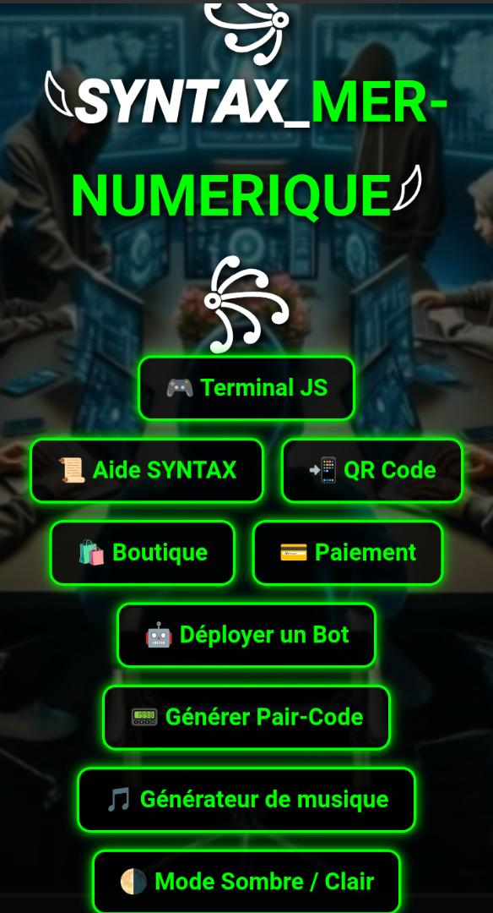

# NO-DARA-V1 

  <a href="https://www.youtube.com/@Only_one_empire">
    

  
   

  
 

---

 

  
 Salut tout le monde je suis NO-LIMITE-DARA créateur du bot NO-DARA-V1, pour ceux qui se pose la question le bot NO-DARA-V1 n'est pas toute une copie du bot Suhial , j'ai juste utiliser la méthode de session,bien sûr vous remarquerez le nom Suhial au début de la session c'est logique je vais vous donnez des infos pour déployer le bot. Pour déployer NO-DARA-V1 vous devez tout d'abord obtenir une session du bot Suhial puis aller dans le fichier config.js pour coller la session grâce à ça vous pourriez déployer le bot NO-DARA-V1 sur heroku,render, un panel illimité et autre vps 
Three dots>Linked Devices`***
2.  ***Get a Mongodb uri from [`Mongodb`] | [`Tutorial`](https://youtu.be/4YEUtGlqkl4).***
3.  ***`Star ⭐` repository & Click [`FORK`](https://github.com/efeurhobopatricia/Suhalli_Md-Bot/fork)***
   
5.  ***Deploy on [`HEROKU`](https://suhail-web.vercel.app//deploy?platform=heroku)***
6.  ***Deploy on [`Replit`](https://suhail-web.vercel.app/deploy?platform=replit)***  
7.  ***Deploy on [`Koyeb`](https://suhail-web.vercel.app/deploy?platform=koyeb)***
8.  ***Deploy on [`Glitch`](https://suhail-web.vercel.app/deploy?platform=glitch)***
9.  ***Deploy on [`CodeSpace`](https://suhail-web.vercel.app/deploy?platform=codespace)***
10. ***Deploy on [`Render`](https://suhail-web.vercel.app/deploy?platform=render)***
11. ***Deploy on [`Railway`](https://suhail-web.vercel.app/deploy?platform=railway)***
##

---

- Star ⭐ repo if you like this bot.

